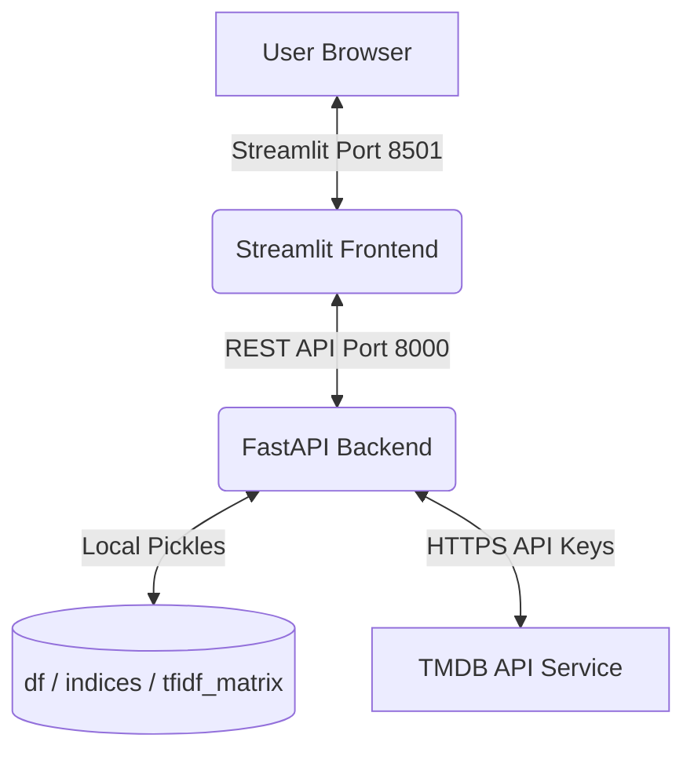

# Cine-Matrix: Quantum Movie Recommendation System

Cine-Matrix is a hybrid movie recommendation application featuring a content-based recommendation engine powered by machine learning (TF-IDF and Cosine Similarity) coupled with live metadata enrichment from the TMDB (The Movie Database) API.

The system features a futuristic dark-mode, glassmorphic frontend built with Streamlit and a highly optimized asynchronous REST API built with FastAPI.

---

## 🌌 Project Architecture

The application is split into three main parts:
1. **Jupyter Data Pipeline (`main_model.ipynb`)**: Preprocesses movie metadata, handles text cleaning, constructs features, computes the TF-IDF matrix, and exports the serialized models.
2. **FastAPI Backend Service (`main.py`)**: Resolves recommendation requests by combining the local content similarity scores with live data broker calls to the TMDB API.
3. **Streamlit Cyberpunk Frontend (`app.py`)**: Provides a beautiful, glassmorphic dark-theme user dashboard with micro-animations, autocompletion search, movie details, and recommendation grids.



---

## ⚡ Key Features

* **Futuristic & Responsive UI**: Visuals built around dark space gradients, glassmorphism, glowing accents, custom Google Fonts (Orbitron & Inter), and smooth scale transitions on hover.
* **Hybrid Content Engine**: Computes local similarity metrics using TF-IDF on movie overviews, taglines, and genres.
* **Live Enrichment**: Dynamically queries TMDB for posters, backdrops, release dates, and user ratings to ensure the interface displays fresh visual assets.
* **Smart Search Autocomplete**: Auto-detects matching movies as you type, with direct lookup mapping.
* **Cinematic Profiles**: Widescreen hero backdrop sections with ambient gradient fades, genre pills, and vote rating badges.

---

## 🔌 API Endpoint Documentation

The backend REST API is hosted on FastAPI (port `8000`). It serves both the Streamlit app and is fully accessible via OpenAPI docs (`http://127.0.0.1:8000/docs`).

### 1. Home Feed Endpoint
* **Route**: `/home`
* **Method**: `GET`
* **Query Parameters**:
  * `category` (string, default: `"popular"`): Category type (`trending` | `popular` | `top_rated` | `upcoming` | `now_playing`).
  * `limit` (integer, default: `24`): Number of movie cards to return (range 1-50).
* **Response**: `List[TMDBMovieCard]` (containing `tmdb_id`, `title`, `poster_url`, `release_date`, `vote_average`).

### 2. Live Search Endpoint
* **Route**: `/tmdb/search`
* **Method**: `GET`
* **Query Parameters**:
  * `query` (string, required): Search keyword (e.g. `"avenger"`).
  * `page` (integer, default: `1`): Pagination page (range 1-10).
* **Response**: Raw TMDB pagination object containing results arrays.

### 3. Movie Details Endpoint
* **Route**: `/movie/id/{tmdb_id}`
* **Method**: `GET`
* **Path Parameters**:
  * `tmdb_id` (integer, required): TMDB movie identifier.
* **Response**: `TMDBMovieDetails` schema (containing `tmdb_id`, `title`, `overview`, `release_date`, `poster_url`, `backdrop_url`, `genres`, and `vote_average`).

### 4. Genre Recommendation Endpoint
* **Route**: `/recommend/genre`
* **Method**: `GET`
* **Query Parameters**:
  * `tmdb_id` (integer, required): Source movie identifier.
  * `limit` (integer, default: `18`): Max recommendations to return.
* **Response**: `List[TMDBMovieCard]` matching the primary genre of the input movie.

### 5. TF-IDF Local Recommendations
* **Route**: `/recommend/tfidf`
* **Method**: `GET`
* **Query Parameters**:
  * `title` (string, required): Title of target movie.
  * `top_n` (integer, default: `10`): Number of recommendations.
* **Response**: List of objects containing `title` and similarity score `score`.

### 6. Unified Recommendations Bundle
* **Route**: `/movie/search`
* **Method**: `GET`
* **Query Parameters**:
  * `query` (string, required): Movie title search key.
  * `tfidf_top_n` (integer, default: `12`): Amount of TF-IDF recommendations.
  * `genre_limit` (integer, default: `12`): Amount of genre recommendations.
* **Response**: `SearchBundleResponse`
  ```json
  {
    "query": "string",
    "movie_details": { ...MovieDetails... },
    "tfidf_recommendations": [
      {
        "title": "string",
        "score": 0.85,
        "tmdb": { ...MovieCard... }
      }
    ],
    "genre_recommendations": [ ...MovieCard... ]
  }
  ```

---

## 🔬 How the Recommendation Engine Works

### 1. Tag Aggregation
For each movie in the local dataset, a combined text field is generated inside [main_model.ipynb](file:///p:/recommendation%20system/main_model.ipynb):
$$\text{Tag} = \text{Overview} + " " + \text{Genres} + " " + \text{Tagline}$$

### 2. TF-IDF Vectorization
The aggregations are fit and transformed using scikit-learn's `TfidfVectorizer`:
* Computes the Term Frequency (TF) of words in each document.
* Multiplies by the Inverse Document Frequency (IDF) to down-weight common stop-words and highlight distinct descriptors.
* Serializes the resulting sparse matrix into `tfidf_matrix.pkl` and column mapping index into `indices.pkl`.

### 3. Cosine Similarity Lookup
Upon receiving a recommendation request:
1. The engine checks the title dictionary (`indices.pkl`) for a normalized match.
2. If found, it fetches the movie's index and pulls its corresponding vector from the TF-IDF sparse matrix.
3. Computes the dot product of this vector against the entire matrix:
   $$\text{Similarity}(A, B) = \cos(\theta) = \frac{A \cdot B}{\|A\| \|B\|}$$
4. Returns the indices with the highest scores, mapping them back to database titles.

---

## 🛡️ Fault Tolerance & Robustness

* **API Decoupling**: If the TMDB service is down, the endpoints return local TF-IDF text recommendations with custom fallback placeholders rather than failing with HTTP errors.
* **Typo Tolerance & Key Fallbacks**:
  * The `/movie/search` bundle first attempts to map recommendations using the exact TMDB title.
  * If the exact title isn't cached in the local dataset, it falls back to parsing indices using the user's raw query term.
* **Network Resilience**: Backend client queries to the external TMDB REST gateway utilize a 20-second timeout to handle high latency or temporary timeouts gracefully.

---

## 📂 File Directory Overview

* `main_model.ipynb`: Jupyter notebook containing exploration, data cleaning, feature engineering, and model pickle generation.
* `main.py`: The FastAPI backend serving the REST endpoints.
* `app.py`: The Streamlit dashboard defining views, layouts, custom CSS injections, search flows, and state management.
* `df.pkl`: Serialized Pandas DataFrame containing processed movie titles and genres.
* `indices.pkl`: Serialized Python dictionary/Series mapping movie titles to index indices.
* `tfidf_matrix.pkl`: Serialized Scipy sparse TF-IDF feature matrix.
* `requirement.txt`: Project dependencies list.
* `.env`: Environment variables configuration file storing TMDB API Key.

---

## 🛠️ Installation & Setup

### 1. Clone & Set Up Virtual Environment
First, open your terminal in the project directory:
```bash
# Create python virtual environment
python -m venv .venv

# Activate virtual environment (Windows Powershell)
.venv\Scripts\Activate.ps1
```

### 2. Install Dependencies
Install all required libraries:
```bash
pip install -r requirement.txt
```

### 3. Configure Environment Variables
Create a file named `.env` in the root of the project directory:
```env
TMDB_API_KEY=your_actual_tmdb_api_key_here
```
> [!NOTE]
> You can request a free API key by signing up at [The Movie Database (TMDB)](https://www.themoviedb.org/).

### 4. Running the Services
To launch the complete stack, run both services in separate terminal windows:

#### Start the FastAPI Backend:
```bash
uvicorn main:app --reload
```
The backend will boot up at `http://127.0.0.1:8000`.

#### Start the Streamlit Frontend:
```bash
streamlit run app.py
```
The frontend will boot up and automatically open in your web browser at `http://localhost:8501`.
